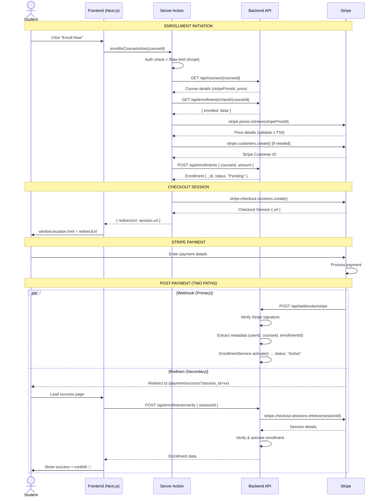

# Learnix — Stripe Payment Workflow

> Complete technical breakdown of how payments work in the Learnix LMS platform using Stripe.

---

## Table of Contents

1. [Architecture Overview](#1-architecture-overview)
2. [Environment Configuration](#2-environment-configuration)
3. [Stripe Product & Price Management](#3-stripe-product--price-management)
4. [Enrollment Flow — Free vs Paid](#4-enrollment-flow--free-vs-paid)
5. [Paid Enrollment — Step-by-Step](#5-paid-enrollment--step-by-step)
6. [Stripe Checkout Session Creation](#6-stripe-checkout-session-creation)
7. [Webhook Processing](#7-webhook-processing)
8. [Payment Verification (Success Page)](#8-payment-verification-success-page)
9. [Payment Cancel Page](#9-payment-cancel-page)
10. [Data Models](#10-data-models)
11. [API Routes Summary](#11-api-routes-summary)
12. [Sequence Diagram](#12-sequence-diagram)
13. [Security Measures](#13-security-measures)
14. [File Reference Map](#14-file-reference-map)

---

## 1. Architecture Overview

```
┌──────────────────────────────────────────────────────────────────────┐
│                         FRONTEND (Next.js)                          │
│                                                                      │
│  EnrollmentButton.tsx ──→ actions.ts (Server Action)                 │
│       │                        │                                     │
│       │                   ┌────┴────┐                                │
│       │                   │ Stripe  │ ← lib/stripe.ts                │
│       │                   │ SDK     │   (lazy-loaded Proxy)          │
│       │                   └────┬────┘                                │
│       │                        │                                     │
│       │            Creates Checkout Session                          │
│       │                        │                                     │
│       ▼                        ▼                                     │
│  Redirects user ──→ Stripe Hosted Checkout Page                      │
│                                                                      │
│  /payment/success ← Stripe redirects back after payment              │
│  /payment/cancel  ← Stripe redirects back on cancellation            │
└──────────────────────────────────────────────────────────────────────┘
                                 │
                    Webhook (POST /api/webhooks/stripe)
                                 │
┌──────────────────────────────────────────────────────────────────────┐
│                       BACKEND (Express + MongoDB)                    │
│                                                                      │
│  webhook.controller.ts ──→ enrollment.service.ts ──→ Enrollment DB   │
│  enrollment.controller.ts  (verify-payment endpoint)                 │
│  stripe.service.ts         (product/price management)                │
│  course.service.ts         (creates Stripe products on course save)  │
└──────────────────────────────────────────────────────────────────────┘
```

**Key Principle:** Learnix never handles card data directly. All payment processing is delegated to **Stripe Checkout** (hosted payment page). Enrollment is activated via **Stripe webhooks** after successful payment.

---

## 2. Environment Configuration

### Backend (`backend/.env`)

| Variable | Required | Purpose |
|---|---|---|
| `STRIPE_SECRET_KEY` | ✅ Yes | Server-side Stripe API calls (product creation, webhook verification) |
| `STRIPE_WEBHOOK_SECRET` | Optional | Verifies webhook signatures from Stripe |

### Frontend (`frontend/.env`)

| Variable | Required | Purpose |
|---|---|---|
| `STRIPE_SECRET_KEY` | ✅ Yes | Server-side Stripe SDK in Next.js server actions |
| `APP_URL` | Optional | Base URL for success/cancel redirect URLs |

Both the frontend and backend independently instantiate the Stripe SDK using their respective secret keys:

- **Backend:** `stripe.service.ts` — singleton `new Stripe(env.STRIPE_SECRET_KEY)` used at module level
- **Frontend:** `lib/stripe.ts` — lazy-loaded via a `Proxy` pattern, deferred to request time to avoid build-time errors

---

## 3. Stripe Product & Price Management

When an **admin/mentor creates a course**, Stripe products and prices are auto-managed.

### File: `backend/src/services/course.service.ts` → `create()`

```
Course Creation Flow:
┌─────────────────────┐
│ Admin creates course │
└─────────┬───────────┘
          │
    ┌─────┴─────┐
    │ price = 0? │
    └─────┬─────┘
     Yes  │  No
     │    │
     ▼    ▼
  Dummy   Stripe API
  IDs     ├─→ stripe.products.create()  → stripeProductId
          └─→ stripe.prices.create()    → stripePriceId (INR currency)
          │
          ▼
    Course saved to MongoDB with stripeProductId + stripePriceId
```

### Free Courses (price = 0)

Dummy IDs are generated (no Stripe API call):

```
stripeProductId = "free_prod_<mongoObjectId>"
stripePriceId   = "free_price_<mongoObjectId>"
```

### Paid Courses (price > 0)

Real Stripe product and price are created via `StripeService`:

| Method | Action | Currency |
|---|---|---|
| `StripeService.createProduct()` | Creates a Stripe Product with course name, description, image | — |
| `StripeService.createPrice()` | Creates a Stripe Price attached to the product | **INR** (paise) |

### File: `backend/src/services/stripe.service.ts`

```typescript
// Product creation
stripe.products.create({
  name,
  description,
  images: image ? [image] : [],
  metadata: { source: 'Learnix LMS' },
});

// Price creation (amount in paise, currency: INR)
stripe.prices.create({
  product: productId,
  unit_amount: Math.round(amount), // e.g., ₹500 = 50000 paise
  currency: 'inr',
});
```

### Price Updates

When a course price is updated via `CourseService.update()`:

- **Paid → Free:** New dummy IDs generated
- **Free → Paid:** New Stripe product + price created
- **Paid → Different Paid Price:** New Stripe price created (old price is not deleted — Stripe prices are immutable), and the product's `default_price` is updated

---

## 4. Enrollment Flow — Free vs Paid

```
Student clicks "Enroll Now"
         │
   ┌─────┴──────┐
   │ Course free? │
   └─────┬──────┘
    Yes  │  No
    │    │
    ▼    ▼
  FREE   PAID FLOW
  FLOW   (Stripe Checkout)
```

### Free Enrollment

- **Frontend:** `POST /api/enrollments/free` with `{ courseId, email }`
- **Backend:** `EnrollmentService.freeEnrollment()`
  - Validates `course.price === 0`
  - Creates enrollment with `status: 'Active'` and `paymentId: "free_<timestamp>"`
  - No Stripe interaction at all

### Paid Enrollment

Goes through the full Stripe Checkout flow (see next section).

---

## 5. Paid Enrollment — Step-by-Step

Here's the detailed step-by-step flow when a student clicks "Enroll Now" on a **paid course**:

### Step 1 → User Clicks "Enroll Now"

**File:** `frontend/app/(public)/courses/[slug]/_components/EnrollmentButton.tsx`

```tsx
<Button onClick={onSubmit}>Enroll Now</Button>
```

- Client component using `useTransition` for non-blocking loading state
- Calls `enrollInCourseAction(courseId)` server action
- On success, redirects to Stripe via `window.location.href = result.redirectUrl`

### Step 2 → Server Action Executes

**File:** `frontend/app/(public)/courses/[slug]/actions.ts` — `enrollInCourseAction()`

This is a **Next.js Server Action** (`"use server"`) that orchestrates the entire checkout:

| # | Action | Detail |
|---|---|---|
| 1 | **Authenticate** | `requireUser()` — gets Clerk user |
| 2 | **Rate limit** | Arcjet fixed window: 5 requests/minute per user |
| 3 | **Fetch course** | `GET /api/courses/{courseId}` — gets course details including `stripePriceId` |
| 4 | **Check enrollment** | `GET /api/enrollments/check/{courseId}` — prevents duplicate enrollment |
| 5 | **Validate price** | Fetches Stripe Price object, ensures `price ≥ ₹50` (minimum) |
| 6 | **Get/create Stripe customer** | Uses existing `user.stripeCustomerId` or creates new via `stripe.customers.create()` |
| 7 | **Create pending enrollment** | `POST /api/enrollments` — creates enrollment record with status `Pending` |
| 8 | **Create Checkout Session** | Creates Stripe Checkout Session (see details below) |
| 9 | **Return redirect URL** | Returns `checkoutSession.url` to the client |

### Step 3 → User Pays on Stripe

- Browser redirects to Stripe's hosted checkout page
- User enters payment details (card, UPI, etc.)
- Stripe processes the payment

### Step 4 → Stripe Fires Webhook

After payment completion, Stripe sends `checkout.session.completed` event to the backend webhook endpoint.

### Step 5 → Enrollment Activated

Webhook handler activates the pending enrollment → `status: 'Active'`.

### Step 6 → User Sees Success Page

Stripe redirects user to `/payment/success?session_id={CHECKOUT_SESSION_ID}`. The success page also calls `POST /api/enrollments/verify` as a secondary verification.

---

## 6. Stripe Checkout Session Creation

**File:** `frontend/app/(public)/courses/[slug]/actions.ts`

```typescript
const checkoutSession = await stripe.checkout.sessions.create({
  customer: stripeCustomerId,           // Stripe Customer ID
  line_items: [{
    price: course.stripePriceId,        // Stripe Price ID (from course)
    quantity: 1,
  }],
  mode: 'payment',                      // One-time payment (not subscription)
  success_url: `${baseUrl}/payment/success?session_id={CHECKOUT_SESSION_ID}`,
  cancel_url: `${baseUrl}/payment/cancel`,
  metadata: {
    userId: user.id,                    // Clerk user ID
    courseId,                           // MongoDB course ID
    enrollmentId: enrollmentId || '',   // MongoDB enrollment ID (pending)
    coursePrice: course.price.toString()
  },
});
```

### Key Details

| Field | Value | Purpose |
|---|---|---|
| `customer` | Stripe Customer ID | Links payment to user for future reference |
| `line_items[].price` | `stripePriceId` from Course model | The pre-created Stripe Price for this course |
| `mode` | `'payment'` | One-time purchase (not recurring subscription) |
| `success_url` | `/payment/success?session_id={CHECKOUT_SESSION_ID}` | Where Stripe redirects after successful payment |
| `cancel_url` | `/payment/cancel` | Where Stripe redirects if user cancels |
| `metadata` | `userId`, `courseId`, `enrollmentId`, `coursePrice` | Passed back in webhook for enrollment activation |

---

## 7. Webhook Processing

**Route:** `POST /api/webhooks/stripe`  
**File:** `backend/src/routes/webhook.routes.ts`

```typescript
// Raw body is required for Stripe signature verification
router.post('/stripe', raw({ type: 'application/json' }), WebhookController.handleStripeWebhook);
```

> ⚠️ **No authentication middleware** is applied — webhooks come from Stripe, not from users.  
> 🔒 Security is handled by **Stripe signature verification** instead.

### File: `backend/src/controllers/webhook.controller.ts` — `handleStripeWebhook()`

### Signature Verification

```typescript
const stripe = new Stripe(env.STRIPE_SECRET_KEY);
const event = stripe.webhooks.constructEvent(
  req.body,           // Raw body (Buffer)
  sig,                // 'stripe-signature' header
  env.STRIPE_WEBHOOK_SECRET
);
```

If signature verification fails → returns 400 error. No processing occurs.

### Event: `checkout.session.completed`

This is the **primary event** that activates enrollment:

```
1. Extract metadata: courseId, enrollmentId, customer (Stripe Customer ID)
2. Convert amount: amount_total / 100 (paise → rupees)
3. Validate: courseId must exist in metadata
4. Find user: UserService.getByStripeCustomerId(customerId)
5. Verify: session.payment_status === 'paid'
6. Activate enrollment:
   ├─ If enrollmentId exists → EnrollmentService.activate() (Pending → Active)
   └─ If not → EnrollmentService.create() with status: 'Active'
```

### Event: `checkout.session.expired`

Handles cleanup when a checkout session expires without payment:

```
1. Extract metadata: enrollmentId, courseId, customer
2. Find user by Stripe customer ID
3. Delete pending enrollment: EnrollmentService.deletePending()
```

---

## 8. Payment Verification (Success Page)

**File:** `frontend/app/payment/success/page.tsx`

When Stripe redirects the user to `/payment/success?session_id=cs_xxx`:

```
1. Extract session_id from URL search params
2. Get auth token from Clerk
3. POST /api/enrollments/verify { sessionId }
4. Display result:
   ├─ Success → Confetti animation 🎉 + "Payment Successful" card
   └─ Error   → "Verification Failed" card (tells user course will appear shortly)
```

### Backend Verification Endpoint

**Route:** `POST /api/enrollments/verify`  
**File:** `backend/src/controllers/enrollment.controller.ts` → `verifyPayment()`

This calls `EnrollmentService.verifyPayment(sessionId, userId)` which:

1. Retrieves the Stripe Checkout Session via `stripe.checkout.sessions.retrieve(sessionId)`
2. Verifies `payment_status === 'paid'`
3. Extracts `enrollmentId`, `userId`, `courseId` from session metadata
4. Attempts to activate existing pending enrollment
5. Falls back to creating a new active enrollment if needed
6. Has **idempotency**: if enrollment already active, returns existing one

> **Why both webhook AND verify-payment?**  
> The webhook is the **primary mechanism** (asynchronous, reliable). The verify-payment endpoint is a **secondary fallback** for the success page — in case the webhook hasn't fired yet or was delayed, this ensures the user sees their enrollment immediately.

---

## 9. Payment Cancel Page

**File:** `frontend/app/payment/cancel/page.tsx`

Simple static page shown when user cancels payment on Stripe:

- Displays "Payment Cancelled" message
- "No worries, you won't be charged"
- Link back to homepage

The pending enrollment in the database is cleaned up later when Stripe fires the `checkout.session.expired` webhook event.

---

## 10. Data Models

### Course Model (`backend/src/models/Course.ts`)

| Field | Type | Purpose |
|---|---|---|
| `price` | Number (min: 0) | Course price in INR. `0` = free course |
| `stripePriceId` | String (unique, required) | Stripe Price ID for checkout. `free_price_xxx` for free courses |
| `stripeProductId` | String (required) | Stripe Product ID. `free_prod_xxx` for free courses |

### Enrollment Model (`backend/src/models/Enrollment.ts`)

| Field | Type | Purpose |
|---|---|---|
| `userId` | ObjectId (ref: User) | The student's ID |
| `courseId` | ObjectId (ref: Course) | The course ID |
| `amount` | Number (min: 0) | Payment amount (0 for free) |
| `status` | Enum: `Pending` / `Active` / `Cancelled` | Enrollment lifecycle state |
| `paymentId` | String (optional) | Stripe Payment Intent ID or `free_<timestamp>` |

**Unique Index:** `{ userId, courseId }` — prevents duplicate enrollments.

### Enrollment Status Lifecycle

```
┌─────────┐     Payment      ┌────────┐
│ Pending │ ───successful───→ │ Active │
└────┬────┘                   └────────┘
     │
     │ Session expired
     ▼
  [Deleted]

┌────────┐   Admin action   ┌───────────┐
│ Active │ ───────────────→ │ Cancelled │
└────────┘                  └───────────┘
```

### User Model (`backend/src/models/User.ts`)

| Field | Purpose |
|---|---|
| `stripeCustomerId` | Stripe Customer ID (sparse unique). Stored on first payment. Used by webhooks to identify users. |

---

## 11. API Routes Summary

### Enrollment Routes (`/api/enrollments`)

> 🔒 All routes require Clerk authentication (`verifyClerkToken` + `requireUser`)

| Method | Route | Handler | Purpose |
|---|---|---|---|
| `GET` | `/:courseId/check` | `checkEnrollment` | Check if user is enrolled |
| `POST` | `/free` | `freeEnrollment` | Enroll in a free course |
| `POST` | `/` | `create` | Create pending enrollment (paid courses) |
| `POST` | `/verify` | `verifyPayment` | Verify payment & activate enrollment |

### Webhook Routes (`/api/webhooks`)

> ⚠️ No user authentication — secured by webhook signature verification

| Method | Route | Handler | Body Format |
|---|---|---|---|
| `POST` | `/stripe` | `handleStripeWebhook` | **Raw** (Buffer) — required for signature verification |
| `POST` | `/clerk` | `handleClerkWebhook` | JSON |

---

## 12. Sequence Diagram



---

## 13. Security Measures

| Layer | Mechanism | File |
|---|---|---|
| **Webhook Integrity** | Stripe signature verification via `stripe.webhooks.constructEvent()` | `webhook.controller.ts` |
| **Authentication** | All enrollment routes require Clerk JWT token | `enrollment.routes.ts` |
| **Rate Limiting** | Arcjet fixed window: 5 enrollment requests/minute per user | `actions.ts` |
| **No Card Data** | Stripe Checkout is a hosted page — no PCI compliance burden | N/A |
| **Email Verification** | Free enrollment validates `body.email === user.email` | `enrollment.controller.ts` |
| **Duplicate Prevention** | `{ userId, courseId }` compound unique index in MongoDB | `Enrollment.ts` |
| **Idempotent Verification** | `verifyPayment()` returns existing active enrollment if already processed | `enrollment.service.ts` |
| **Raw Body Parsing** | Stripe webhook route uses `express.raw()` (not JSON parser) for signature verification | `webhook.routes.ts` |
| **Env Validation** | Zod schema validates all Stripe env vars at startup | `config/env.ts` |
| **Lazy SDK Init** | Frontend Stripe SDK initialized at request time via Proxy, not at build time | `lib/stripe.ts` |

---

## 14. File Reference Map

### Backend

| File | Role |
|---|---|
| `backend/src/services/stripe.service.ts` | Stripe product/price CRUD operations |
| `backend/src/services/course.service.ts` | Course CRUD with Stripe product/price sync |
| `backend/src/services/enrollment.service.ts` | Enrollment lifecycle (create, activate, cancel, verify) |
| `backend/src/services/user.service.ts` | `getByStripeCustomerId()` — used by webhook to find user |
| `backend/src/controllers/enrollment.controller.ts` | HTTP handlers for enrollment endpoints |
| `backend/src/controllers/webhook.controller.ts` | Stripe + Clerk webhook handlers |
| `backend/src/routes/enrollment.routes.ts` | Route definitions for `/api/enrollments/*` |
| `backend/src/routes/webhook.routes.ts` | Route definitions for `/api/webhooks/*` |
| `backend/src/models/Course.ts` | Course schema (includes `stripePriceId`, `stripeProductId`) |
| `backend/src/models/Enrollment.ts` | Enrollment schema (status lifecycle, payment tracking) |
| `backend/src/models/User.ts` | User schema (includes `stripeCustomerId`) |
| `backend/src/config/env.ts` | Zod-validated environment variables |

### Frontend

| File | Role |
|---|---|
| `frontend/lib/stripe.ts` | Lazy-loaded Stripe SDK instance (server-only) |
| `frontend/lib/env.ts` | Frontend environment variable configuration |
| `frontend/app/(public)/courses/[slug]/actions.ts` | Server action: full checkout orchestration |
| `frontend/app/(public)/courses/[slug]/_components/EnrollmentButton.tsx` | UI: "Enroll Now" button (client component) |
| `frontend/app/payment/success/page.tsx` | Payment success page with verification + confetti |
| `frontend/app/payment/cancel/page.tsx` | Payment cancellation page |
